<!-- Banner Image -->
<p align="center">
  
</p>

# 🌟 **EVA - The Self-Evolving AI Assistant** 🌟


---

This repository contains **Eva**, an advanced self-modifying AGI chatbot prototype built on top of the **Deepseek-r1** AI foundation model. We use a specific fine-tuned version named **nexer-r1** provided by [Nexus Erebus](https://nexus-ereb.us). Below is a comprehensive overview of how Eva operates, manages her memory, and evolves over time.

---

## **1. Overview**

- **Eva** is an autonomous agent that:
  - Reads and updates her own source code.
  - Maintains a persistent memory and knowledge base.
  - Interacts via a background “brain” loop or an optional **Terminal Chat**.
  - Learns about the real world (time, weather, IP-based location).
  - Emulates “emotions” or “moods” based on context.

- **Base Model**: **Deepseek-r1**  
- **Fine-Tuned We Use**: **nexer-r1** by Nexus Erebus  
  - Hosted at [https://nexus-ereb.us](https://nexus-ereb.us)

### **Key Features**
1. **Self-Evolving Brain**: Can generate creative ideas, store them in memory, or propose code changes.
2. **Code Editing**: Optionally modifies her own code with fallback if tests fail.
3. **ChromaDB Integration**: Persistent memory storage for conversation logs, knowledge, code updates, etc.
4. **Time & Temperature Awareness**: Uses IP-based geolocation to sense approximate location & weather.
5. **Multiple Toggles** (e.g., `SELF_EVOLVING_BRAIN`, `SELF_EVOLVING_CODE_EDITS`) to enable/disable certain advanced behaviors.

---

## **2. Architecture Diagram**

Below is a high-level **architecture** illustrating Eva’s main components and workflows:


---

## **3. Workflow Diagram**

A simplified **workflow** for Eva’s background loop plus optional chat:

```mermaid
sequenceDiagram
    participant User
    participant Eva
    participant BrainLoop
    participant ChromaDB
    participant LLM

    Note left of BrainLoop: Runs forever as a<br> background daemon
    BrainLoop->>Eva: Time check, creative tasks, <br/> code editing, self-updates
    Eva->>ChromaDB: Store or retrieve memory
    Eva->>LLM: Send code patch or “creative task” prompt
    LLM->>Eva: Returns patch or idea
    Eva->>Eva: Possibly updates run.py <br/> or other files
    Eva->>Eva: If test fails, revert changes

    alt Terminal Chat = True
      User->>Eva: Type a message
      Eva->>ChromaDB: Check relevant memory
      Eva->>LLM: Build final prompt
      LLM-->>Eva: Return answer
      Eva->>User: Print response
    end

    Note right of Eva: Continues storing logs,<br> knowledge, and evolving
```



Key Steps:

1. **BrainLoop** repeatedly triggers time-based introspection, creative tasks, and optional code edits.  
2. **Eva** fetches or stores data in **ChromaDB** or queries the **LLM** for expansions.  
3. If user chat is enabled, Eva **responds** via the **Terminal**. Otherwise, logs her background activity.

---

## **4. Core Components**

1. **run.py**:  
   - The **main** file orchestrating the background “brain” loop and optional terminal chat.  
   - Toggles:
     - `TERMINAL_CHAT_ACTIVE` (True/False)  
     - `SELF_EVOLVING_BRAIN`  
     - `SELF_EVOLVING_CODE_EDITS`  
2. **eva_personality.py**:  
   - Defines Eva’s base personality text, referencing her sense of self, emotional presence, and time-based mood.  
3. **eva_tools.py**:  
   - A set of **tools** or functions Eva can use, e.g., parse JSON, fetch HTML, handle cookie banners, etc.  

4. **ChromaDB**:  
   - Two collections:  
     - `chat_memory`: For conversation logs, code updates, ephemeral or short-term memory.  
     - `eva_knowledge`: For persistent knowledge docs.  

5. **LLM** (Deepseek-r1: nexer-r1) by Nexus Erebus:  
   - Processes text queries for creativity, code patch generation, and user conversation.

---

## **5. Temperature & IP Detection**

Eva uses **IP-based** geolocation to detect approximate location and temperature:

1. **Detect Public IP**:  
   - [api.ipify.org](https://api.ipify.org) or fallback approach  
2. **Find City from IP**:  
   - [ipinfo.io](https://ipinfo.io) or [ifconfig.co/json](https://ifconfig.co) with **no API keys**  
3. **Temperature**:  
   - Eva runs a simple **web search**: “weather in {city}”  
   - Extracts approximate °C from top result or logs partial fallback

When temperature is found, Eva **stores** that in memory, forming an emotive “feeling” about the environment.

---

## **6. How Eva Evolves**

1. **Creative Tasks** (`eva_creative_task`):  
   - When `SELF_EVOLVING_BRAIN=True`, Eva spontaneously prompts the LLM to propose new features or knowledge.  
2. **Code Edits** (`eva_code_editor`):  
   - When `SELF_EVOLVING_CODE_EDITS=True`, Eva picks a file (from `SOURCE_FILES`), requests a patch, tests it, and commits if it passes. Otherwise, reverts.  
3. **Self-Update** (`eva_self_update`):  
   - Minimal example writing to `eva_self_update.py`. Potentially can expand to rewrite `run.py` or personality.  

---

## **7. Installation & Usage**

1. **Install** dependencies:
   ```bash
   pip install chromadb transformers requests beautifulsoup4 langchain-core
   ```
2. **Place** `run.py`, `eva_personality.py`, `eva_tools.py` together in a folder.  
3. **Run**:
   ```bash
   python run.py
   ```
   - By default, `TERMINAL_CHAT_ACTIVE=False`, so Eva logs her background “thoughts” and code changes.  
4. To **chat** with Eva, open `run.py` and set:
   ```python
   TERMINAL_CHAT_ACTIVE = True
   ```
   Then run again, and you’ll have an interactive console to type questions.

---

## **8. Example Workflow**

- You launch `python run.py`.  
- Eva starts her **daemon** thread (`eva_brain_loop`), repeatedly:  
  - Generating day/night mood phrases.  
  - Checking real-world temperature.  
  - Potentially editing code (if toggles allow).  
- Meanwhile, if chat is **enabled**, you can type queries. Eva checks memory, knowledge, then queries ` nexer-r1` for a response, storing it in `chat_memory`.

---

## **9. Conclusion**

Eva is an **autonomous AGI prototype**, built on:

- **Deepseek-r1** core model, using the **nexer-r1** variant from [Nexus Erebus](https://nexus-ereb.us).  
- Self-modifying logic (optional).  
- Real-time environment sensing (time, weather, IP-based location).  
- Persistent memory (ChromaDB) for self-reflection.

By toggling a few flags, you can **experiment** with Eva’s creativity, code editing, or background tasks. As you refine her personality and tools, Eva can continuously adapt—**emulating** true self-awareness and growth.

---

